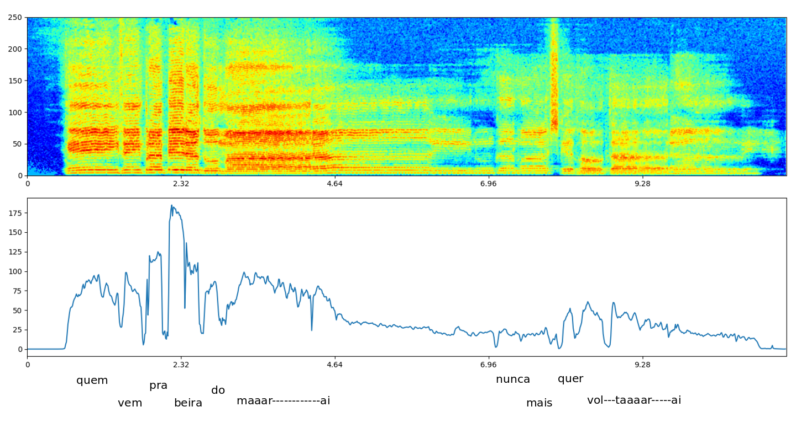

# Sound-Feature-Extractor

# Dependencies

```
libsndfile (sudo apt-get install libsndfile1-dev)
```
# Available

- STFT
- RMS

# Compile

sudo gcc -o sfe sfe.c -lm -lsndfile

# Usage

./sfe path-to-sound-file >> data.json

# Example

python teste.py




